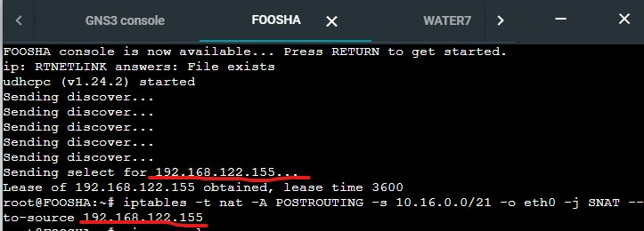
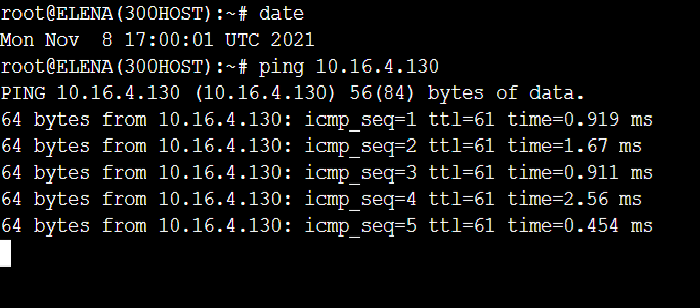
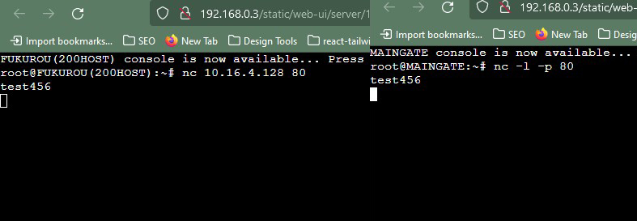
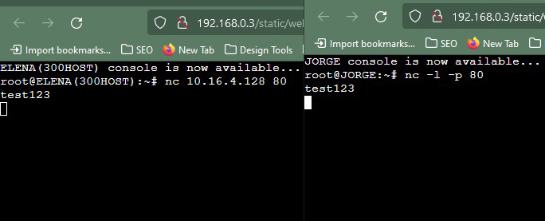

# Jarkom-Modul-5-C04-2021

Kelompok : C4

Anggota Kelompok :

- Muhammad Arif Faizin (05111940000060)
- Aufi Fillah (05111940000148)
- Abiya Sabitta Ragadani (05111940000166)

# Soal

Setelah kalian mempelajari semua modul yang telah diberikan, Luffy ingin meminta bantuan untuk terakhir kalinya kepada kalian. Dan kalian dengan senang hati mau membantu Luffy.

A. Tugas pertama kalian yaitu membuat topologi jaringan sesuai dengan rancangan yang diberikan Luffy dibawah ini:


Keterangan :

- Doriki adalah DNS Server
- Jipangu adalah DHCP Server
- Maingate dan Jorge adalah Web Server
- Jumlah Host pada Blueno adalah 100 host
- Jumlah Host pada Cipher adalah 700 host
- Jumlah Host pada Elena adalah 300 host
- Jumlah Host pada Fukurou adalah 200 host

B. Karena kalian telah belajar subnetting dan routing, Luffy ingin meminta kalian untuk membuat topologi tersebut menggunakan teknik CIDR atau VLSM. setelah melakukan subnetting,

C. Kalian juga diharuskan melakukan Routing agar setiap perangkat pada jaringan tersebut dapat terhubung.

D. Tugas berikutnya adalah memberikan ip pada subnet Blueno, Cipher, Fukurou, dan Elena secara dinamis menggunakan bantuan DHCP server. Kemudian kalian ingat bahwa kalian harus setting DHCP Relay pada router yang menghubungkannya.

1. Agar topologi yang kalian buat dapat mengakses keluar, kalian diminta untuk mengkonfigurasi Foosha menggunakan iptables, tetapi Luffy tidak ingin menggunakan MASQUERADE.
2. Kalian diminta untuk mendrop semua akses HTTP dari luar Topologi kalian pada server yang merupakan DHCP Server dan DNS Server demi menjaga keamanan.
3. Karena kelompok kalian maksimal terdiri dari 3 orang. Luffy meminta kalian untuk membatasi DHCP dan DNS Server hanya boleh menerima maksimal 3 koneksi ICMP secara bersamaan menggunakan iptables, selebihnya didrop.

Kemudian kalian diminta untuk membatasi akses ke Doriki yang berasal dari subnet Blueno, Cipher, Elena dan Fukuro dengan beraturan sebagai berikut 4. Akses dari subnet Blueno dan Cipher hanya diperbolehkan pada pukul 07.00 - 15.00 pada hari Senin sampai Kamis. 5. Akses dari subnet Elena dan Fukuro hanya diperbolehkan pada pukul 15.01 hingga pukul 06.59 setiap harinya.
Selain itu di reject 6. Karena kita memiliki 2 Web Server, Luffy ingin Guanhao disetting sehingga setiap request dari client yang mengakses DNS Server akan didistribusikan secara bergantian pada Jorge dan Maingate

Luffy berterima kasih pada kalian karena telah membantunya. Luffy juga mengingatkan agar semua aturan iptables harus disimpan pada sistem atau paling tidak kalian menyediakan script sebagai backup.

# Jawaban

## No 1

Pada soal nomor 1, diminta untuk mengkonfigurasi Foosha menggunakan iptables tanpa menggunakan MASQUERADE. Code yang kami jalankan merupakan `iptables -t nat -A POSTROUTING -s 10.16.0.0/20 -o eth0 -j SNAT --to-source 192.168.122.251` dengan subnet yang disesuaikan berdasarkan tree yang telah dibuat dan source yang didapat dari ketika node foosha diaktifkan:



untuk mengetes apakah foosha sudah tersambung dengan internet, lakukan `ping google.com`

## No 2

Pada soal nomor 2, diminta untuk mendrop semua akses HTTP dari luar Topologi pada server yang merupakan DHCP Server dan DNS Server demi menjaga keamanan.

Untuk melakukannya, kita melakukan konfigurasi pada router foosha yang merupakan penghubung dengan DHCP dan DNS server `iptables -A FORWARD -d 10.16.4.128/29 -p tcp --dport 80 -j DROP` dengan -d berisi ip dari subnet yang dituju, dalam kasus ini merupakan ip subnet dimana DHCP dan DNS server berada

Untuk melakukan testing apakah sudah terfilter, maka dilakukan `nmap -p 80 10.16.4.130` pada host manapun

Apabila pada console terlihat output `Filtered`, maka filter sudah berjalan dengan baik.

## No 3

Pada soal nomor 3 diminta untuk membatasi akses ke dhcp dan dns server dengan maksimal 3 koneksi ICMP. maka dari itu digunakan IP TABLES pada doriki dan jipangu seperti berikut.

```bash
iptables -A INPUT -m state --state ESTABLISHED,RELATED -j ACCEPT
iptables -A INPUT -p icmp -m connlimit --connlimit-above 3 --connlimit-mask 0 -j DROP
```

Keterangan:

* `-A INPUT`: Menggunakan chain INPUT
* `-p icmp`: Mendefinisikan protokol yang digunakan, yaitu ICMP (ping)
* `-m connlimit`: Menggunakan rule connection limit
* `--connlimit-above 3`: Limit yang ditangkap paket adalah di atas 3
* `--connlimit-mask 0` : Hanya memperbolehkan 3 koneksi setiap subnet dalam satu waktu
* `-j DROP`: Paket di-drop

Untuk testing maka dilakukan ping ke doriki atau jipangu melalui 4 node, dan nantinya pada node ke 4 tidak bisa melakukan koneksi ping, dimana pada testing ini node ke 4 yaitu elena tidak dapat melakukan ping ke doriki


## No 4

Pada nomor ini diminta untuk node blueno dan chiper hanya bisa mengakses doriki pada pukul 7.00 - 15.00, pada hari Senin hingga Kamis. Maka dari itu digunakan IP TABLES pada doriki seperti berikut

```bash
#Blueno
iptables -A INPUT -s 10.16.4.0/25 -m time --timestart 07:00 --timestop 15:00 --weekdays Mon,Tue,Wed,Thu -j ACCEPT
iptables -A INPUT -s 10.16.4.0/25 -j REJECT
#Chiper
iptables -A INPUT -s 10.16.0.0/22 -m time --timestart 07:00 --timestop 15:00 --weekdays Mon,Tue,Wed,Thu -j ACCEPT
iptables -A INPUT -s 10.16.0.0/22 -j REJECT
```

Keterangan:

* `-A INPUT` : menggunakan CHAIN INPUT
* `-s 10.16.4.0` : mendefinisikan alamat asal (BLUENO)
* `-s 10.16.0.0` : mendefinisikan alamat asal (Chiper)
* `-m time` : menggunakan rule time
* `--timestart 07:00` : mendefinisikan waktu mulai
* `--timestop 15:00` : mendefinisikan waktu berhenti
* `--weekdays Mon,Tue,Wed,Thu` : mendefinisikan hari yaitu Senin hingga Kamis
* `--j ACCEPT` : Paket di-Accept
* `--j Reject` : Paket di-Reject

Untuk testing yaitu menset waktu pada node terlebih dahulu kemudian dilakukan ping ke doriki


## No 5

Diminta untuk membatasi akses yang menuju ke Doriki yang berasal dari Elena dan Fukurou agar hanya dapat mengakses pukul 15.01 hingga pukul 06.59 di setiap harinya

Maka, perlu untuk mengatur iptables yang berasal dari Elena (10.16.12.0/23) dan Fukurou (10.16.8.0/24) dengan iptables berikut

```
iptables -A INPUT -s 10.16.12.0/23 -m time --timestart 15:01 --timestop 23:59 -j ACCEPT
iptables -A INPUT -s 10.16.12.0/23 -m time --timestart 00:00 --timestop 06:59 -j ACCEPT
iptables -A INPUT -s 10.16.8.0/24 -m time --timestart 15:01 --timestop 23:59 -j ACCEPT
iptables -A INPUT -s 10.16.8.0/24 -m time --timestart 00:00 --timestop 06:59 -j ACCEPT
iptables -A INPUT -s 10.16.12.0/23 -j REJECT
iptables -A INPUT -s 10.16.8.0/24 -j REJECT
```

Iptables tersebut menerima packet sesuai dengan waktu yang ditentukan soal, dan menolak packet yang diluar jam tersebut




## No 6

Diminta untuk menyetting Guanhao agar setiap request dari client yang mengakses DNS Server akan didistribusikan secara bergantian pada Jorge dan Maingate.

Sebelum menyetting Guanhao, kita harus melakukan setting DNS Servernya terlebih dahulu, yaitu Doriki.

Ubah file `/etc/bind/named.conf.local` menjadi seperti berikut

```
//
// Do any local configuration here
//

// Consider adding the 1918 zones here, if they are not used in your
// organization
//include "/etc/bind/zones.rfc1918";

zone "jarkomC04.com" {
        type master;
        file "/etc/bind/jarkom/jarkomC04.com";
};
```

Lalu buat direktori dengan nama `/etc/bind/jarkom` menggunakan `mkdir /etc/bind/jarkom`. Kemudian buat salinan dari `/etc/bind/db.local` ke `/etc/bind/jarkom` dengan nama jarkomC04.com menggunakan command `cp /etc/bind/db.local /etc/bind/jarkom/jarkomC04.com`. Kemudian edit file tersebut sehingga seperti berikut

```
;
; BIND data file for local loopback interface
;
$TTL    604800
@       IN      SOA     jarkomC04.com. root.jarkomC04.com. (
                              2         ; Serial
                         604800         ; Refresh
                          86400         ; Retry
                        2419200         ; Expire
                         604800 )       ; Negative Cache TTL
;
@       IN      NS      jarkomC04.com.
@       IN      A       10.16.4.128
```

Lalu restart atau start bind9 untuk menjalankan server dengan command `service bind9 restart`

Kemudian setting iptables pada Guanhao untuk membuat setiap request yang dikirimkan ke DNS Server akan dibagi ke Jorge dan Maingate

```
iptables -A PREROUTING -t nat -p tcp -d 10.16.4.128/29 --dport 80 -m statistic --mode nth --every 2 --packet 0 -j DNAT --to-destination  10.16.9.2:80
iptables -A PREROUTING -t nat -p tcp -d 10.16.4.128/29 --dport 80 -j DNAT --to-destination 10.16.9.3:80
iptables -t nat -A POSTROUTING -p tcp -d 10.16.9.2 --dport 80 -j SNAT --to-source 10.16.4.128:80
iptables -t nat -A POSTROUTING -p tcp -d 10.16.9.3 --dport 80 -j SNAT --to-source 10.16.4.128:80
```

Pada kode

```
iptables -A PREROUTING -t nat -p tcp -d 10.16.4.128/29 --dport 80 -m statistic --mode nth --every 2 --packet 0 -j DNAT --to-destination  10.16.9.2:80
iptables -A PREROUTING -t nat -p tcp -d 10.16.4.128/29 --dport 80 -j DNAT --to-destination 10.16.9.3:80
```

setiap paket yang menuju destionation `-d` dari DNS Server (10.16.4.128/29) dan dengan port `80` kemudian dialihkan ke Jorge (10.16.9.2:80) dan Maingate (10.16.9.3:80)

Kemudian paket tersebut dialihkan kembali ke DNS Server menggunakan 2 iptables setelahnya.

Lalu langkah terakhir setting lagi Doriki sebagai DNS Server agara dapat menerima paket yg dikirimkan oleh client menggunakan iptables `iptables -A INPUT -m state --state ESTABLISHED,RELATED -j ACCEPT`

ESTABLISHED berarti paket yang dikirimkan sudah diterima dan dikenali di client dan server. RELATED berarti menunjukkan paket yang dikirimkan telah sesuai

Kemudian install netcat di Jorge dan Maingate menggunakan command `apt-get install netcat -y`. Kemudian jalankan command `nc -l -p 80` untuk mendengarkan packet dari client.

Lalu install netcat di 2 client yang akan mengirimkan packet, kemudian jalankan command `nc 10.16.4.128 80` untuk mengkoneksikan dengan DNS Server.

Lalu ketik apapun dan enter untuk mengirim paket, maka paket yang dikirimkan akan secara bergantian didistribusikan pada Jorge dan Maingate.




