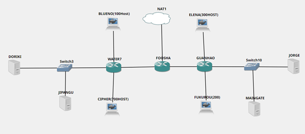

# Jarkom-Modul-5-C04-2021

Kelompok : C4

Anggota Kelompok :

- Muhammad Arif Faizin (05111940000060)
- Aufi Fillah (05111940000148)
- Abiya Sabitta Ragadani (05111940000166)

# Soal
Setelah kalian mempelajari semua modul yang telah diberikan, Luffy ingin meminta bantuan untuk terakhir kalinya kepada kalian. Dan kalian dengan senang hati mau membantu Luffy.

A. Tugas pertama kalian yaitu membuat topologi jaringan sesuai dengan rancangan  yang diberikan Luffy dibawah ini:

Keterangan :     
* Doriki adalah DNS Server
* Jipangu adalah DHCP Server
* Maingate dan Jorge adalah Web Server
* Jumlah Host pada Blueno adalah 100 host
* Jumlah Host pada Cipher adalah 700 host
* Jumlah Host pada Elena adalah 300 host
* Jumlah Host pada Fukurou adalah 200 host

B. Karena kalian telah belajar subnetting dan routing, Luffy ingin meminta kalian untuk membuat topologi tersebut menggunakan teknik CIDR atau VLSM. setelah melakukan subnetting, 

C. Kalian juga diharuskan melakukan Routing agar setiap perangkat pada jaringan tersebut dapat terhubung.

D. Tugas berikutnya adalah memberikan ip pada subnet Blueno, Cipher, Fukurou, dan Elena secara dinamis menggunakan bantuan DHCP server. Kemudian kalian ingat bahwa kalian harus setting DHCP Relay pada router yang menghubungkannya.

1. Agar topologi yang kalian buat dapat mengakses keluar, kalian diminta untuk mengkonfigurasi Foosha menggunakan iptables, tetapi Luffy tidak ingin menggunakan MASQUERADE.
2. Kalian diminta untuk mendrop semua akses HTTP dari luar Topologi kalian pada server yang merupakan DHCP Server dan DNS Server demi menjaga keamanan.
3. Karena kelompok kalian maksimal terdiri dari 3 orang. Luffy meminta kalian untuk membatasi DHCP dan DNS Server hanya boleh menerima maksimal 3 koneksi ICMP secara bersamaan menggunakan iptables, selebihnya didrop.

Kemudian kalian diminta untuk membatasi akses ke Doriki yang berasal dari subnet Blueno, Cipher, Elena dan Fukuro dengan beraturan sebagai berikut
4. Akses dari subnet Blueno dan Cipher hanya diperbolehkan pada pukul 07.00 - 15.00 pada hari Senin sampai Kamis.
5. Akses dari subnet Elena dan Fukuro hanya diperbolehkan pada pukul 15.01 hingga pukul 06.59 setiap harinya.
Selain itu di reject
6. Karena kita memiliki 2 Web Server, Luffy ingin Guanhao disetting sehingga setiap request dari client yang mengakses DNS Server akan didistribusikan secara bergantian pada Jorge dan Maingate

Luffy berterima kasih pada kalian karena telah membantunya. Luffy juga mengingatkan agar semua aturan iptables harus disimpan pada sistem atau paling tidak kalian menyediakan script sebagai backup.

# Jawaban

## No 1

## No 2

## No 3

## No 4

## No 5

## No 6